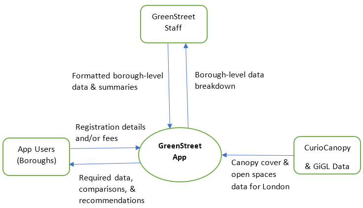

# Coursework 2

# Executive Summary
Following on from the previous submission which focused on the project methodology, business understanding, data 
preparation, and data exploration. This submission is centred around the requirements, design and testing phase. Given 
that the chosen project was methodology was scrum, the following portfolio of artefacts is designed through processes
that took that into consideration. 

In summary, general users or members of the public as well as borough officials will be able to sign up on the web app.
They can then look up information on all boroughs in Greater London within the scope of this project which relates to 
canopy cover and open space area information. Each borough has information on its area, the percentage of area covered 
canopy and open spaces, and the breakdown of those open spaces into further categories such as parks, playgrounds, 
woodland and more. This information is further complimented by general recommendations for each borough in managing its
canopy cover or open space areas, as well as how boroughs within London compare to each other. If needed, users can 
access a list of professional firms and agencies that can provide detailed suggestions, with the list being suggested 
based on the information that is sought out for by the user, such as a specific open space area type or canopy cover
requirements. 

## Technical information

### Set-up instructions
Installed Packages:
* matplotlib
* pandas
* openpyxl
* numpy

# 1. Requirements
## 1.1 Scope of the App
The following context diagram illustrates the scope of the app. 

*Figure 1. Context diagram of the project*
##1.2 Elicitation of Requirements
To elicit the requirements for the web app, several elicitation methods were ideal. Methods such as interviews with 
borough officials or focus groups of landscapers and urban planners should have been utilised, as well brainstorming by 
the project team. However, due to the limitations imposed by UCL’s Research Ethics, external entities or members of the
public could not be involved in the elicitation of requirements, leaving individual brainstorming as the only available 
method to elicit or identify the requirements for the project. 

##1.3 Specification & Ranking of Requirements
Since the scrum methodology was used in this project, user stories are used to express or advocate the requirements as 
is recommended for agile methods. However, the user stories are not the requirements themselves, merely the end goals 
of the project and convey the value of what needs to be created for the project to be successful (Rehkopf, n.d.).

To rank the requirements, the MoSCoW prioritisation method was used, and this breaks down the ranks into the following 
four categories: M-must have, S-should have, C-could have, and W-won't have. 

The 'must have' category is assigned to the requirements that are deemed necessary for the project to be a success, and 
must be delivered on in the initial iteration. The 'should have' category is important, but can be held back if time 
becomes a critical issue. If there is enough time and resources to spare, the 'could have' requirements are also 
included, whereas the 'won't have' category is reserved for requirements that have the lowest payback and/or are not 
included in the current delivery timeline (International Institute of Business Analysis, 2009).

## 1.4 List of Requirements
The resulting list of requirements, due to issues with how tables are supported in markdown, have been attached in a pdf 
document as Table 1: 

[Table 1. List of Requirements](PDF Files/Requirements Table.pdf)
# 2. Design
The design section in this document for the project is mainly concerned with the selection of classes, the structure and
flow of the web app’s interface with the routes, views and controller functions, some wireframe examples, and an entity 
relationship diagram (ERD). 
## 2.1 Classes
The first step in designation of the classes was to utilise the Domain-driven Design (DDD) approach (Evans, 2003), as it 
is helpful in decomplicating project designs. This required a series of steps, mainly concerned with the aforementioned 
requirements table, where nouns, noun phrases, adjectives, verbs, and verb phrases were identified. In detail, these 
steps are:
1. In the requirements table, bold all nouns and noun phrases
2. Create of list of the bolded selections
3. Bold all adjectives relevant for a bolded noun or noun phrase
4. Assign the bolded adjectives to each relevant noun or noun phrase, with duplicates removed
5. Underline all verbs or verb phrases
6. Assign the underlined selection to each relevant noun or noun phrase, with duplicates removed
7. Iterate over the requirements table again
8. Add data types for each adjective/attribute
9. Using the list of underlined verbs and verb phrases, create a list of methods that can be used for each class, with 
the appropriate parameters (if any) and return types.

This series of steps culminated in Table 2. List of classes with attributes and methods. Ultimately, three resulting 
classes are finalised with potential methods and attributes. 

*Table 2. List of classes with attributes and methods*

*The breakdown of open space areas into types is derived from the following list:
1.	Adventure playground
2.	Agriculture
3.	Allotments
4.	Amenity green space
5.	Canal
6.	Cemetery/churchyard
7.	City farm
8.	Civic/market square
9.	Common
10.	Community garden
11.	Country park
12.	Disused railway trackbed
13.	Educational
14.	Equestrian centre
15.	Formal garden
16.	Golf course
17.	Landscaping around premises
18.	Nature reserve
19.	Park
20.	Play space
21.	Playing fields
22.	Private woodland
23.	Public woodland
24.	Railway cutting
25.	Recreation ground
26.	Reservoir
27.	River
28.	Road island/verge
29.	Sewage/water works
30.	Vacant land
31.	Village green
32.	Walking/cycling route
33.	Youth area
34.	Other recreational areas
35.	Other hard surfaced areas
36.	Other

## 2.2 App Interface
Given the requirements and the classes, the app interface can begin to take shape with the modelling of the flow of web 
pages, and from there can be derived the views and controller functions. As this is still in the conceptual stage to 
some exist, wireframes have been used to demonstrate some of the most vital web pages of the app, although keeping in 
mind changes are likely in the future. 

Figure 1 illustrates the flow of web pages in the app and user interactions. This figure was created using LucidChart, a
software by Lucid Inc. which is an online diagramming app. 

*Figure 1. Flow of app interface*

Some wireframes of prominent web pages of the app have also been illustrated below through Figure 2,3,4, and 5.

*Figure 2. Wireframe of login page (View 01)*

*Figure 3. Wireframe of borough summary page (View 02)*

*Figure 4. Wireframe of canopy cover suggestions page (View 06)*

*Figure 5. Wireframe of borough open spaces summary page (View 08)*
## 2.3 Routes and Controller Functions
Given the classes and the interface, the routes can be presented in a tabulated format with their respective controller 
functions. Table 3 presents the views and the controller functions with a short description of each controller function 
as well as the respective view ID in Figure 1. 

[Table 3. Routes, view IDs, and controller functions](https://github.com/ucl-comp0035/coursework-1-WalidShkh/blob/master/Table%20of%20Routes.pdf)

## 2.4 Relational Database Design
This section deals with the SQLite database design aspect, which takes information from the list of classes in Table 2,
resulting in an Entity Relationship Diagram (ERD). The ERD is normalised to third normal form. This simply means that 
the ERD satisfies the following conditions:
* Each cell has only one entry
* Each row and column in a table is unique from the others
* Each table has a primary key 
* Relationships between tables are shown using primary and foreign keys
* There is no transitive dependency (records can be deleted without losing needed values)
* There are no many-to-many relationships

The ERD also identifies the data types and any constraints for the attributes for each class. Attributes with no 
constraints are optional and not required. The ERD is illustrated in Figure 6.

*Figure 6. Entity relationship diagram of the web app*

# References
Evans, Eric. (2003). *Domain-driven design*. New Jersey, United States: Pearson Education.

International Institute of Business Analysis. (2009). *A Guide to the Business Analysis Body of Knowledge*. 2nd Edition. Toronto, Canada: International Institute of Business Analysis.

Rehkopf, Max. (n.d.). *User stories with examples and a template*. Retrieved from: https://www.atlassian.com/agile/project-management/user-stories 